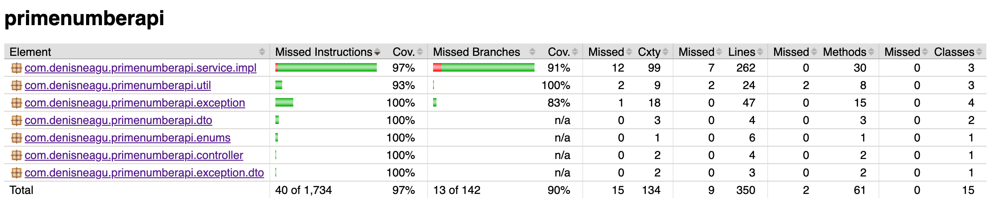

### Prime Number API
Calculate prime numbers up to and including a limit using diverse algorithms. 
Choose your response layout and calculation strategy using query parameters.
### Project Set-up
**Note**: We'll need [JDK 17](https://www.oracle.com/java/technologies/javase/jdk17-0-13-later-archive-downloads.html)
and [Maven](https://maven.apache.org/download.cgi) installed.
```text
1. git clone https://github.com/denis-neagu/prime-number-api
2. cd primenumberapi
3. mvn clean install
4. mvn spring-boot:run
```
### Tech Stack
- **Java Version**: 17
- **Framework**: Spring Boot
- **Testing**: JUnit, Mockito, REST-Assured
- **Build & Dependency Management**: Maven
- **Annotation Processing and Productivity**: Lombok
- **Serialisation/Deserialisation**: Jackson
- **Deployment**: AWS, EC2, Virtual Private Cloud (VPC)
- **Continuous Integration**: GitHub Workflows 
### Deployment
**Note:** No-configuration, easy-deployment platforms such as Heroku or Render provide HTTP(S) out the box. AWS EC2 does not enable HTTP(S) out of the box. 
To enable it we could use a reverse proxy like Nginx in the EC2 instance, but we'd need a certificate from a Certificate Authority (CA).
We could use a self-signed certificate, but we'd still receive a warning message. 
Alternatively we could also use a modern Load Balancer such as AWS Application Load Balancer (ALB) and use AWS' Certificate Manager (ACM).<br>

**Note:** I have mapped the app to port 8080 in the EC2 instance, and you need to explicitly define the port in the URL before making a request. 
Otherwise, by default HTTP uses port 80, so it won't be making the request to the correct resource.

**Note:** The EC2 instance only provides 1GB of RAM and 1vCPU, therefore the number of primes we can calculate is limited to a small number around 100 million. 
We could use more vertical scaling using more RAM and CPU Cores to support higher calculations.

URL: http://ec2-18-132-106-253.eu-west-2.compute.amazonaws.com:8080/api/v1/primes
### Features
- Diverse algorithms: Trial Division, Optimised Trial Division, Sieve of Eratosthenes, Segmented Sieve, Bitset Segmented Sieve
- Caching
- Cache merges
- REST API
- Invalid input handling
- Global exception handler including fallback responses
- JSON and XML support
- Swagger documentation
- Test coverage 

### Observations
1. JSON is more memory-efficient than XML, allowing more prime numbers to be displayed.
   Using cURL further increases this limit because it streams data in chunks to standard output, avoiding the browser’s
   memory constraints and enabling serialization of much larger datasets.  
   <br>
2. Using Bitset significantly saves us memory consumption, but have to be managed carefully when used
   concurrently because it's not thread-safe.  
   <br>
3. Caching strategy immensely speeds up performance. Mixing caching with cache merges is also a
   great tool for speeding up performance on calculations that aren't yet cached. However, this has to be safely managed
   by setting a cache threshold relative to the total available memory to avoid memory consumptions growing indefinitely which would
   crash our application and be an inefficient way to implement caching. In addition to a threshold, I've implemented a cache reset, so when the threshold is reached we clear our cache to ensure
   a risk-free environment and running out of memory.  
   <br>
4. The best algorithm for the job depends on multiple constraints such as: input size, available threads, and memory.
   For example, a Concurrent Segmented Sieve is highly-performant for large input sizes, but uses a lot of memory due Multithreading
   and for small input sizes it's slower than a naive algorithm. Moreover, a BitSet Segmented Sieve is slower than a Concurrent Segmented Sieve,
   but it's more memory efficient so we can calculate more prime numbers, but at a slower pace. Furthermore, a naive algorithm can be
   great for small input sizes, but inefficient and not scalable for huge inputs.

### API Endpoint
##### `HTTP GET /api/v1/primes`
##### Query Parameters
| Parameter Name | Type               | Description                                                                                                                                                                                                      | Constraints                             | Default Value              |
|----------------|--------------------|------------------------------------------------------------------------------------------------------------------------------------------------------------------------------------------------------------------|-----------------------------------------|----------------------------|
| `limit`        | `long`             | Specifies the upper bound for the range of numbers to process.                                                                                                                                                   | Must be at least 2 (`@Min(2)`).         | None (required parameter). |
| `showPrimes`   | `boolean`          | Indicates whether to include prime numbers in the response. If `false` then returns empty array.                                                                                                                 | None.                                   | `false`                    |
| `algorithm`    | `Algorithm` (Enum) | Specifies the algorithm to use for processing. Expected values include:`NAIVE_TRIAL_DIVISION`, `NAIVE_TRIAL_DIVISION_OPTIMISED`, `SIEVE_OF_ERATOSTHENES`, `CONCURRENT_SEGMENTED_SIEVE`, `SEGMENTED_SIEVE_BITSET` | Must be a valid `Algorithm` enum value. | `NAIVE_TRIAL_DIVISION`     |
| `cache`        | `boolean`          | Determines whether to use caching for the operation to improve performance.                                                                                                                                      | None.                                   | `false`                    |
##### Example 1 - Valid Request with JSON response
###### Request
`HTTP GET /api/v1/primes?limit=50`<br>
`-H accept: application/json` 

###### Response
```json
{
  "algorithm": "NAIVE_TRIAL_DIVISION",
  "cache": false,
  "execTimeInNs": 44615,
  "execTimeInMs": 0,
  "timestamp": "2025-10-26T15:40:35.550205426",
  "numOfPrimes": 15,
  "primes": []
}
```
##### Example 2 - Valid Request with XML response
###### Request
`HTTP GET /api/v1/primes?limit=50`<br>
`-H accept: application/xml` 
###### Response 
```xml
<PrimeNumberResponse>
    <algorithm>NAIVE_TRIAL_DIVISION</algorithm>
    <cache>false</cache>
    <execTimeInNs>44615</execTimeInNs>
    <execTimeInMs>0</execTimeInMs>
    <timestamp>2025-10-26T15:40:35.550205426</timestamp>
    <numOfPrimes>15</numOfPrimes>
    <primes/>
</PrimeNumberResponse>
```
##### Example 3 - Invalid Request (missing limit query parameter) with JSON response
###### Request
`HTTP GET /api/v1/primes`<br>
`-H accept: application/xml`
###### Response 
```json
{
    "httpStatus": 400,
    "description": "Required request parameter 'limit' of type 'long' is missing",
    "errorThrownAt": "2025-10-26T15:47:45.433075"
}
```
### Testing Coverage Report - JaCoCo
